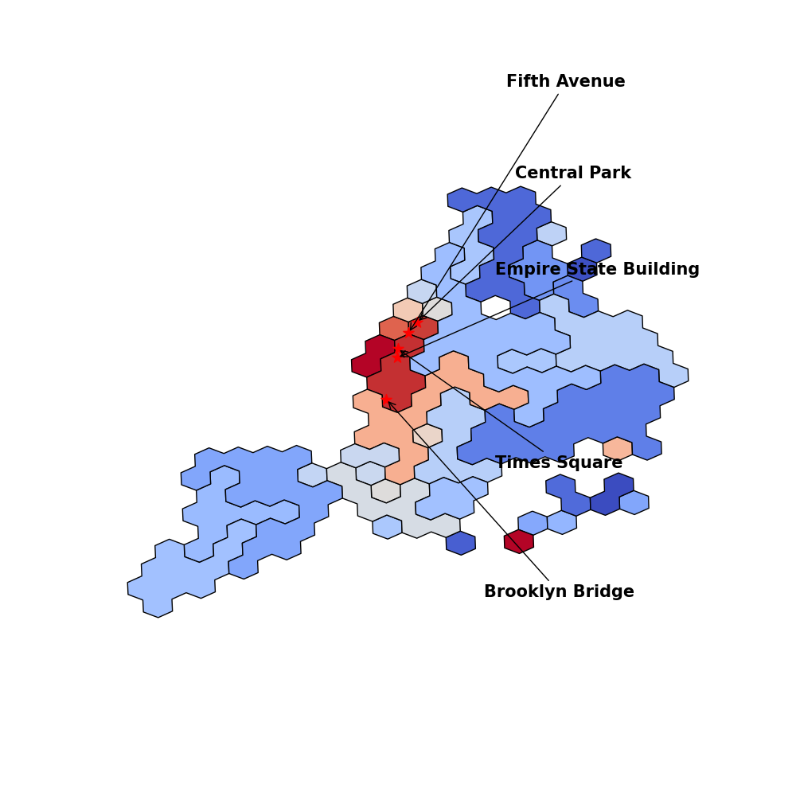

# HexaClus

This repository contains the implementation for supervised spatial clustering algorithm as presented in:

**HexaClus: An Interpretable Hexagonal Supervised Spatial Clustering Method**

## Data set 

For the data sets used in the paper, see

[**London property prices**](https://www.kaggle.com/datasets/jakewright/house-price-data)

[**New York property prices**](https://www.kaggle.com/datasets/nelgiriyewithana/new-york-housing-market)

[**Paris property prices**](https://www.kaggle.com/datasets/benoitfavier/immobilier-france)

## Visualisation 

* London

* New York

* Paris

